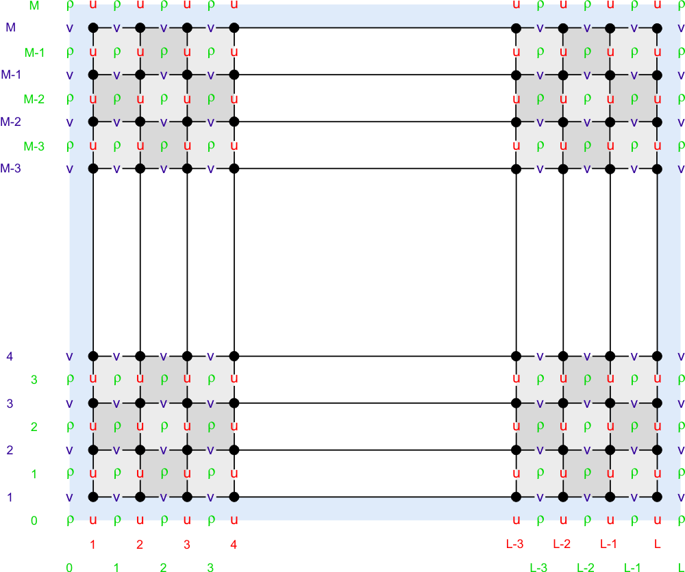
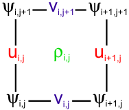
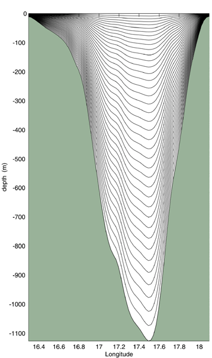
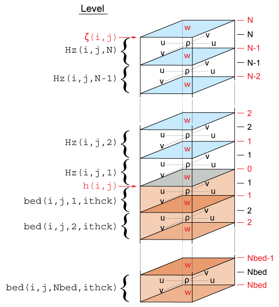
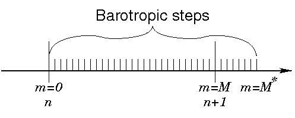
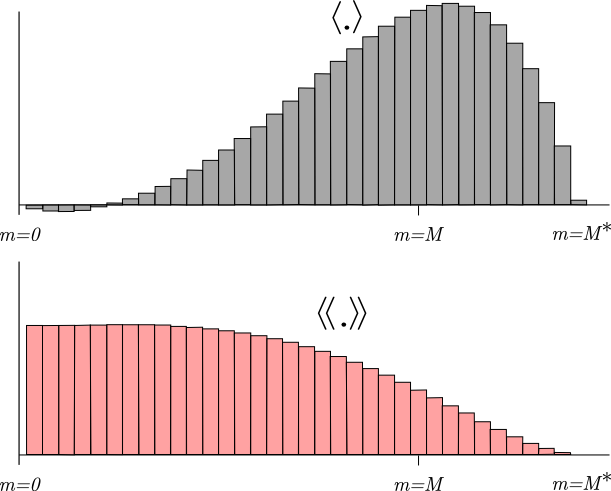

 .. role:: cpp(code)
    :language: c++

.. _Numerical_Solution:

Numerical Solution Technique
============================
.. _Horizontal_Discretization:

Horizontal Discretization
-------------------------
In the horizontal, the ROMSX governing equations are discretized over a boundary-fitted, orthogonal curvilinear coordinates :math:`\left(\xi,\eta\right)` grid. The general formulation of the curvilinear coordinates system allows Cartesian, polar, and spherical coordinates applications. The transformation of any of these coordinates to ROMSX :math:`\left(\xi,\eta\right)` grid is specified in the metric terms (``pm``, ``pn``).

The model state variables are staggered using an ``Arakawa C-grid``. As illustrated below, the free-surface (``zeta``), density (``rho``), and active/passive tracers (``t``) are located at the center of the cell whereas the horizontal velocity (``u`` and ``v``) are located at the west/east and south/north edges of the cell, respectively. That is, the density is evaluated between points where the currents are evaluated.

Staggered Horizontal Grid
~~~~~~~~~~~~~~~~~~~~~~~~~

In ROMSX all the state arrays are dimensioned the same size to facilitate parallelization. However, the computational ranges for all the state variables are:

Grid Cell
~~~~~~~~~

+--------------------------+---------------------------+-------------------------+
| Variable                 | Interior Range            | Full Range              |
+==========================+===========================+=========================+
| :math:`\rho\text{-type}` | 1:``Lm(ng)``,1:``Mm(ng)`` | 0:``L(ng)``,0:``M(ng)`` |
+--------------------------+---------------------------+-------------------------+
| :math:`\psi\text{-type}` | 2:``Lm(ng)``,2:``Mm(ng)`` | 1:``L(ng)``,1:``M(ng)`` |
+--------------------------+---------------------------+-------------------------+
| :math:`\text{u-type}`    | 2:``Lm(ng)``,1:``Mm(ng)`` | 1:``L(ng)``,0:``M(ng)`` |
+--------------------------+---------------------------+-------------------------+
| :math:`\text{v-type}`    | 1:``Lm(ng)``,2:``Mm(ng)`` | 0:``L(ng)``,1:``M(ng)`` |
+--------------------------+---------------------------+-------------------------+

.. _Vertical_Discretization:

Vertical Discretization
-----------------------
The ROMSX governing equations are discretized over variable topography using a stretched, terrain-following, vertical coordinate. As a result, each grid cell may have different level thickness (``Hz``) and volume. The model state variables are vertically staggered so that horizontal momentum (``u``, ``v``), (``rho``), and active/passive tracers (``t``) are located at the center of the grid cell. The vertical velocity (``omega``, ``w``) and vertical mixing variables (``Akt``, ``Akv``, etc) are located at the bottom and top faces of the cell. See diagram below.

Vieste-Dubrovnik Transect
~~~~~~~~~~~~~~~~~~~~~~~~~

Staggered Vertical Grid
~~~~~~~~~~~~~~~~~~~~~~~

In this diagram, indices are 1-indexed (as in ROMS), while the indices in ROMS-X are 0-indexed.

The total thickness of the water column is :math:`\zeta\left(i,j\right)+h\left(i,j\right)`. The bathymetry (``h``) is usually time invariant whereas the free-surface (``zeta``) evolves in time. At input and output, the bathymetry is always a positive quantity. However, the depths ``z_r(i,j,k)`` and ``z_w(i,j,k)`` are negative for all locations below the mean sea level.

Grid Variables
~~~~~~~~~~~~~~
+-------------------------------------------------+-----------------------------+------------------------------------------------------------------+-------------------+-------------------+
| Variable                                        | Variable in Code            | Definition                                                       | Location          | Origin            |
+=================================================+=============================+==================================================================+===================+===================+
| m                                               |                             | x-dir coordinate                                                 | corners           |                   |
+-------------------------------------------------+-----------------------------+------------------------------------------------------------------+-------------------+-------------------+
| n                                               |                             | y-dir coordinate                                                 | corners           |                   |
+-------------------------------------------------+-----------------------------+------------------------------------------------------------------+-------------------+-------------------+
| :math:`\xi`                                     |                             | transformed x-dir orthogonal curvilinear coordinate              | corners           |                   |
+-------------------------------------------------+-----------------------------+------------------------------------------------------------------+-------------------+-------------------+
| :math:`\eta`                                    |                             | transformed y-dir orthogonal curvilinear coordinate              | corners           |                   |
+-------------------------------------------------+-----------------------------+------------------------------------------------------------------+-------------------+-------------------+
| :math:`\zeta`                                   |                             | free-surface                                                     | center            |                   |
+-------------------------------------------------+-----------------------------+------------------------------------------------------------------+-------------------+-------------------+
| :math:`\rho`                                    | ``rho``                     | density                                                          | center            | equation of state |
+-------------------------------------------------+-----------------------------+------------------------------------------------------------------+-------------------+-------------------+
| :math:`t`                                       |                             | active/passive tracers                                           | center            |                   |
+-------------------------------------------------+-----------------------------+------------------------------------------------------------------+-------------------+-------------------+
| :math:`u`                                       | ``vec_Huon``                | x-dir horizontal velocity                                        | west/east faces   |                   |
+-------------------------------------------------+-----------------------------+------------------------------------------------------------------+-------------------+-------------------+
| :math:`v`                                       | ``vec_Hvom``                | y-dir horizontal velocity                                        | north/south faces |                   |
+-------------------------------------------------+-----------------------------+------------------------------------------------------------------+-------------------+-------------------+
| :math:`\overline{u}`                            | ``vec_ubar``                | x-dir vertically integrated momentum                             | west/east faces   |                   |
+-------------------------------------------------+-----------------------------+------------------------------------------------------------------+-------------------+-------------------+
| :math:`\overline{v}`                            | ``vec_vbar``                | y-dir vertically integrated momentum                             | west/east faces   |                   |
+-------------------------------------------------+-----------------------------+------------------------------------------------------------------+-------------------+-------------------+
| :math:`\psi`                                    |                             |                                                                  | corners           |                   |
+-------------------------------------------------+-----------------------------+------------------------------------------------------------------+-------------------+-------------------+
| :math:`H_z`                                     | ``vec_Hz`                   | level thickness                                                  | center            |                   |
+-------------------------------------------------+-----------------------------+------------------------------------------------------------------+-------------------+-------------------+
| :math:`\omega`                                  |                             | vertical velocity                                                | bottom/top faces  |                   |
+-------------------------------------------------+-----------------------------+------------------------------------------------------------------+-------------------+-------------------+
| :math:`w`                                       |                             | vertical velocity                                                | bottom/top faces  |                   |
+-------------------------------------------------+-----------------------------+------------------------------------------------------------------+-------------------+-------------------+
| Akt                                             | ``vec_Akv``                 | vertical mixing                                                  | bottom/top faces  |                   |
+-------------------------------------------------+-----------------------------+------------------------------------------------------------------+-------------------+-------------------+
| Akv                                             |                             | vertical mixing                                                  | bottom/top faces  |                   |
+-------------------------------------------------+-----------------------------+------------------------------------------------------------------+-------------------+-------------------+
| :math:`h`                                       | ``vec_hOfTheConfusingName`` | bathymetry (always positive)                                     |                   |                   |
+-------------------------------------------------+-----------------------------+------------------------------------------------------------------+-------------------+-------------------+
| :math:`z_{r\left(i,j,k\right)}`                 |                             | depth (negative below sea level)                                 | center            |                   |
+-------------------------------------------------+-----------------------------+------------------------------------------------------------------+-------------------+-------------------+
| :math:`z_{w\left(i,j,k\right)}`                 |                             | depth (negative below sea level)                                 | bottom/top faces  |                   |
+-------------------------------------------------+-----------------------------+------------------------------------------------------------------+-------------------+-------------------+
| :math:`T`                                       | ``vec_t3``                  | temperature                                                      |                   |                   |
+-------------------------------------------------+-----------------------------+------------------------------------------------------------------+-------------------+-------------------+
| :math:`S`                                       | ``vec_s3``                  | salinity                                                         |                   |                   |
+-------------------------------------------------+-----------------------------+------------------------------------------------------------------+-------------------+-------------------+
| :math:`D_{crit}`                                |                             | critical depth                                                   |                   |                   |
+-------------------------------------------------+-----------------------------+------------------------------------------------------------------+-------------------+-------------------+
| :math:`D`                                       |                             | total water depth                                                |                   |                   |
+-------------------------------------------------+-----------------------------+------------------------------------------------------------------+-------------------+-------------------+
| :math:`C`                                       |                             | concentration                                                    |                   |                   |
+-------------------------------------------------+-----------------------------+------------------------------------------------------------------+-------------------+-------------------+
| :math:`\delta_{\xi}`                            |                             | centered finite-difference approximation of :math:`\Delta\xi`    |                   |                   |
+-------------------------------------------------+-----------------------------+------------------------------------------------------------------+-------------------+-------------------+
| :math:`\delta_{\eta}`                           |                             | centered finite-difference approximation of :math:`\Delta\eta`   |                   |                   |
+-------------------------------------------------+-----------------------------+------------------------------------------------------------------+-------------------+-------------------+
| :math:`\delta_{\sigma}`                         |                             | centered finite-difference approximation of :math:`\Delta\sigma` |                   |                   |
+-------------------------------------------------+-----------------------------+------------------------------------------------------------------+-------------------+-------------------+
| :math:`\Delta_{\xi}`                            |                             | transformed x-dir differential distance                          |                   |                   |
+-------------------------------------------------+-----------------------------+------------------------------------------------------------------+-------------------+-------------------+
| :math:`\Delta_{\eta}`                           |                             | transformed y-dir differential distance                          |                   |                   |
+-------------------------------------------------+-----------------------------+------------------------------------------------------------------+-------------------+-------------------+
| :math:`\Delta_{\sigma}`                         | ``vec_s_r``                 | transformed z-dir differential distance                          |                   |                   |
+-------------------------------------------------+-----------------------------+------------------------------------------------------------------+-------------------+-------------------+
| :math:`\Delta_{z}`                              |                             | vertical distance from one :math:`\rho` to another               |                   |                   |
+-------------------------------------------------+-----------------------------+------------------------------------------------------------------+-------------------+-------------------+
| :math:`\overline{\left(\qquad\right)}^{\xi}`    |                             | average taken over :math:`\Delta\xi`                             |                   |                   |
+-------------------------------------------------+-----------------------------+------------------------------------------------------------------+-------------------+-------------------+
| :math:`\overline{\left(\qquad\right)}^{\eta}`   |                             | average taken over :math:`\Delta\eta`                            |                   |                   |
+-------------------------------------------------+-----------------------------+------------------------------------------------------------------+-------------------+-------------------+
| :math:`\overline{\left(\qquad\right)}^{\sigma}` |                             | average taken over :math:`\Delta\sigma`                          |                   |                   |
+-------------------------------------------------+-----------------------------+------------------------------------------------------------------+-------------------+-------------------+
| :math:`\Delta V`                                |                             | grid box volume                                                  |                   |                   |
+-------------------------------------------------+-----------------------------+------------------------------------------------------------------+-------------------+-------------------+

Conservation Properties
-----------------------
From ``Shchepetkin and McWilliams (2005)``, we have a tracer concentration equation in advective form:

.. math::
   \frac{\partial C}{\partial t}+\left(u\cdot\nabla\right)C=0
   :label: (1)

and also a tracer concentration equation in conservation form:

.. math::
   \frac{\partial C}{\partial t}+\nabla\cdot\left(uC\right)=0.
   :label: (2)

The continuity equation:

.. math::
   \left(\nabla\cdot u\right)=0
   :label: (3)

can be used to get from one tracer equation to the other.  As a consequence of eq. (1), if the tracer is spatially uniform, it will remain so regardless of the velocity field (constancy preservation). On the other hand, as a consequence of (2), the volume integral of the tracer concentration is conserved in the absence of internal sources and fluxes through the boundary. Both properties are valuable and should be retained when constructing numerical ocean models.

The semi-discrete form of the tracer equation is:

.. math::
   \frac{\partial}{\partial t}\left(\frac{H_zC}{mn}\right)+\delta_{\xi}\left(\frac{u\overline{H_z}^{\xi}\overline{C}^{\xi}}{\overline{n}^{\xi}}\right)+\delta_{\eta}\left(\frac{v\overline{H_z}^{\eta}\overline{C}^{\eta}}{\overline{m}^{\eta}}\right)+\delta_{\sigma}\left(\overline{C}^{\sigma}\frac{H_z\Omega}{mn}\right)= \\
    \frac{1}{mn}\frac{\partial}{\partial\sigma}\left(\frac{K_m}{\Delta z}\frac{\partial C}{\partial\sigma}\right)+\mathcal{D}_C+\mathcal{F}_C
   :label: (4)

Here :math:`\delta_{\xi},\delta_{\eta}` and :math:`\delta_{\sigma}` denote simple centered finite-difference approximations to :math:`\partial/\partial\xi,\partial/\partial\eta` and :math:`\partial/\partial\sigma` with the differences taken over the distances :math:`\Delta\xi,\Delta\eta` and :math:`\Delta\sigma`, respectively. :math:`\Delta z` is the vertical distance from one :math:`\rho` point to another. :math:`\overline{\left(\qquad\right)}^{\xi}, \overline{\left(\qquad\right)}^{\eta}` and :math:`\overline{\left(\qquad\right)}^{\sigma}` represent averages taken over the distances :math:`\Delta\xi,\Delta\eta` and :math:`\Delta\sigma`.

The finite volume version of the same equation is no different, except that a quantity :math:`C` is defined as the volume-averaged concentration over the grid box :math:`\Delta V`:

.. math::
   C=\frac{mn}{H_z}\int_{\Delta V}\frac{H_z C}{mn}\delta\xi\ \delta\eta\ \delta\sigma

The quantity :math:`\left(\dfrac{u\overline{H_z}^{\xi}\overline{C}^{\xi}}{\overline{n}^{\xi}}\right)` is the flux through an interface between adjacent grid boxes.

This method of averaging was chosen because it internally conserves first moments in the model domain, although it is still possible to exchange mass and energy through the open boundaries.  The method is similar to that used in ``Arakawa and Lamb``; though their scheme also conserves enstrophy. Instead, we will focus on (nearly) retaining constancy preservation while coupling the barotropic (depth-integrated) equations and the baroclinic equations.

The timestep in eq. (4) is assumed to be from time :math:`n` to time :math:`n+1`, while the other terms being evaluated at time :math:`n+1/2` for second-order accuracy.  Setting :math:`C` to :math:`1` everywhere reduces eq. (4) to:

.. math::
   \frac{\partial}{\partial t}\left(\frac{H_z}{mn}\right)+\delta_{\xi}\left(\frac{u\overline{H_z}^{\xi}}{\overline{n}^{\xi}}\right)+\delta_{\eta}\left(\frac{v\overline{H_z}^{\eta}}{\overline{m}^{\eta}}\right)+\delta_{\sigma}\left(\frac{H_z\Omega}{mn}\right)=0
   :label: (5)

If this equation holds true for the step from time :math:`n` to time :math:`n+1`, then constancy preservation will hold.

In a hydrostatic model such as ROMSX, the discrete continuity equation is needed to compute vertical velocity rather than grid-box volume :math:`\dfrac{H_z}{mn}` (the latter is controlled by changes in :math:`\zeta` in the barotropic mode computations). Here, :math:`\dfrac{H_z\Omega}{mn}` is the finite-volume flux across the `moving` grid-box interface, vertically on the :math:`w` grid.

The vertical integral of the continuity equation (5), using the vertical boundary conditions on :math:`\Omega`, is:

.. math::
   \frac{\partial}{\partial t}\left(\frac{\zeta}{mn}\right)+\delta_{\xi}\left(\frac{\overline{u}\overline{D}^{\xi}}{\overline{n}^{\xi}}\right)+\delta_{\eta}\left(\frac{\overline{v}\overline{D}^{\eta}}{\overline{m}^{\eta}}\right)=0
   :label: (6)

where :math:`\zeta` is the surface elevation, :math:`D=h+\zeta` is the total depth, and :math:`\overline{u},\overline{v}` are the depth-integrated horizontal velocities. This equation and the corresponding 2-D momentum equations are timestepped on a shorter timestep than eq.(4) and the other 3-D equations. Due to the details in the mode coupling, it is only possible to maintain constancy preservation to the accuracy of the barotropic timesteps.

Depth-Integrated Equations
--------------------------
The depth average of a quantity :math:`A` is given by:

.. math::
   \overline{A}=\frac{1}{D}\int_{-1}^0H_zA\ d\sigma
   :label: (7)

where the overbar indicates a vertically averaged quantity and

.. math::
   D\equiv\zeta\left(\xi,\eta,t\right)+h\left(\xi,\eta\right)
   :label: (8)

is the total depth of the water column.  The vertical integral of the momentum equations are:

.. math::
   \frac{\partial}{\partial t}\left(\frac{D\overline{u}}{mn}\right)+\frac{\partial}{\partial\xi}\left(\frac{D\overline{uu}}{n}\right)+\frac{\partial}{\partial\eta}\left(\frac{D\overline{uv}}{m}\right)-&\frac{Df\overline{v}}{mn}\\
   -\left[\overline{vv}\frac{\partial}{\partial\xi}\left(\frac{1}{n}\right)-\overline{uv}\frac{\partial}{\partial\eta}\left(\frac{1}{m}\right)\right]D=-\frac{D}{n}&\left(\frac{\partial\overline{\phi_2}}{\partial\xi}+g\frac{\partial\zeta}{\partial\xi}\right)\\
   +\frac{D}{mn}\left(\overline{\mathcal{F}}_u+\overline{\mathcal{D}}_{h_u}\right)&+\frac{1}{mn}\left(\tau^{\xi}_s-\tau^{\xi}_b\right)
   :label: (9)

and

.. math::
   \frac{\partial}{\partial t}\left(\frac{D\overline{v}}{mn}\right)+\frac{\partial}{\partial\xi}\left(\frac{D\overline{uv}}{n}\right)+\frac{\partial}{\partial\eta}\left(\frac{D\overline{vv}}{m}\right)+&\frac{Df\overline{u}}{mn}\\
   +\left[\overline{uv}\frac{\partial}{\partial\xi}\left(\frac{1}{n}\right)-\overline{uu}\frac{\partial}{\partial\eta}\left(\frac{1}{m}\right)\right]D=-\frac{D}{m}&\left(\frac{\partial\overline{\phi_2}}{\partial\eta}+g\frac{\partial\zeta}{\partial\eta}\right)\\
   +\frac{D}{mn}\left(\overline{\mathcal{F}}_v+\overline{\mathcal{D}}_{h_v}\right)+&\frac{1}{mn}\left(\tau_s^{\eta}-\tau_b^{\eta}\right)
   :label: (10)

where :math:`\phi_2` includes the :math:`\frac{\partial z}{\partial\xi}` term, :math:`\overline{\mathcal{D}}_{h_u}` is the horizontal viscosity, and the vertical viscosity only contributes through the upper and lower boundary conditions. We also need the vertical integral of the continuity equation, shown above as eq. (6).
The presence of a free surface introduces waves which propagate at a speed of :math:`\sqrt{gh}`. These waves usually impose a more severe time-step limit than any of the internal processes. We have therefore chosen to solve the full equations by means of a split time step. In other words, the depth integrated equations (9), (10), and (6) are integrated using a short time step and the values of :math:`\overline{u}` and :math:`\overline{v}` are used to replace those found by integrating the full equations on a longer time step. A diagram of the barotropic time stepping is shown here:

Some of the terms in equations (9) and (10) are updated on the short time step while others are not. The contributions from the slow terms are computed once per long time step and stored. If we call these terms :math:`R_{u_{\text{slow}}}` and :math:`R_{v_{\text{slow}}}`, equations (9) and (10) become:

.. math::
   \frac{\partial}{\partial t}\left(\frac{D\overline{u}}{mn}\right)+\frac{\partial}{\partial\xi}\left(\frac{D\overline{u}\,\overline{u}}{n}\right)+\frac{\partial}{\partial\eta}\left(\frac{D\overline{u}\,\overline{v}}{m}\right)&-\frac{Df\overline{v}}{mn}\\
   -\left[\overline{v}\,\overline{v}\frac{\partial}{\partial\xi}\left(\frac{1}{n}\right)-\overline{u}\,\overline{v}\frac{\partial}{\partial\eta}\left(\frac{1}{m}\right)\right]D&=R_{u_{\text{slow}}}-\frac{gD}{n}\frac{\partial\zeta}{\partial\xi}+\frac{D}{mn}\mathcal{D}_{\overline{u}}-\frac{1}{mn}\tau_{b}^{\xi}\\
   :label: (11)

and

.. math::
   \frac{\partial}{\partial t}\left(\frac{D\overline{v}}{mn}\right)+\frac{\partial}{\partial\xi}\left(\frac{D\overline{u}\,\overline{v}}{n}\right)+\frac{\partial}{\partial\eta}\left(\frac{D\overline{v}\,\overline{v}}{m}\right)&+\frac{Df\overline{u}}{mn}\\
   +\left[\overline{u}\,\overline{v}\frac{\partial}{\partial\xi}\left(\frac{1}{n}\right)-\overline{u}\,\overline{u}\frac{\partial}{\partial\eta}\left(\frac{1}{m}\right)\right]D&=R_{v_{\text{slow}}}-\frac{gD}{m}\frac{\partial\zeta}{\partial\eta}+\frac{D}{mn}\mathcal{D}_{\overline{v}}-\frac{1}{mn}\tau_{b}^{\eta}.
   :label: (12)

When time stepping the model, we compute the right-hand-sides for the full 3-D momentum equations as well as the right-hand-sides for equations (11) and (12). The vertical integral of the 3-D right-hand-sides are obtained and then the 2-D right-hand-sides are subtracted. The resulting fields are the slow forcings :math:`R_{u_{\text{slow}}}` and :math:`R_{v_{\text{slow}}}`. This was found to be the easiest way to retain the baroclinic contributions of the non-linear terms such as :math:`\overline{uu}-\overline{u}\,\overline{u}`.
The model is time stepped from time :math:`n` to time :math:`n+1` by using short time steps on equations (11), (12) and (6). Equation (6) is time stepped first, so that an estimate of the new :math:`D` is available for the time rate of change terms in equations (11) and (12). A third-order predictor-corrector time stepping is used. In practice, we actually time step all the way to time :math:`\left(n+\textbf{dtfast}\times M^*\right)` and while maintaining weighted averages of the values of :math:`\overline{u},\overline{v}` and :math:`\zeta`. The averages are used to replace the values at time :math:`n+1` in both the baroclinic and barotropic modes, and for recomputing the vertial grid spacing :math:`H_z`. The following figure shows one option for how these weights might look:

The primary weights, :math:`a_m`, are used to compute :math:`\langle\zeta\rangle^{n+1}\equiv\overunderset{M^*}{m=1}{\sum}a_m\zeta^m`. There is a related set of secondary weights :math:`b_m`, used as :math:`\langle\!\langle\overline{u}\rangle\!\rangle^{n+\frac{1}{2}}\equiv\overunderset{M^*}{m=1}{\sum}b_m\overline{u}^m`. In order to maintain constancy preservation, this relation must hold:

.. math::
   \langle\zeta\rangle_{i,j}^{n+1}=\langle\zeta\rangle_{i,j}^n&-\\
   \left(mn\right)_{i,j}\Delta t&\left[\left\langle\!\!\left\langle\frac{D\overline{u}}{n}\right\rangle\!\!\right\rangle_{i+\frac{1}{2},j}^{n+\frac{1}{2}}-\left\langle\!\!\left\langle\frac{D\overline{u}}{n}\right\rangle\!\!\right\rangle_{i-\frac{1}{2},j}^{n+\frac{1}{2}}+\left\langle\!\!\left\langle\frac{D\overline{v}}{m}\right\rangle\!\!\right\rangle_{i,j+\frac{1}{2}}^{n+\frac{1}{2}}-\left\langle\!\!\left\langle\frac{D\overline{v}}{m}\right\rangle\!\!\right\rangle_{i,j-\frac{1}{2}}^{n+\frac{1}{2}}\right]
   :label: (13)

``Shchepetkin and McWilliams (2005)`` introduce a range of possible weights, but the ones used here have a shape function:

.. math::
   A\left(\tau\right)=A_0\left\{\left(\frac{\tau}{\tau_0}\right)^p\left[1-\left(\frac{\tau}{\tau_0}\right)^q\right]-r\frac{\tau}{\tau_0}\right\}
   :label: (14)

where :math:`p,q` are parameters and :math:`A_0,\tau_0`, and :math:`r` are chosen to satisfy normalization, consistency, and second-order accuracy conditions,

.. math::
   I_n=\int_0^{\tau^*}\tau^nA\left(\tau\right)d\tau=1,\qquad n=0,1,2
   :label: (15)

using Newton iterations. :math:`\tau^*` is the upper limit of :math:`\tau` with :math:`A\left(\tau\right)\geq0`. In practice we initially set

.. math::
   A_0=1,r=0,\text{    and    }\tau=\frac{\left(p+2\right)\left(p+q+2\right)}{\left(p+1\right)\left(p+q+1\right)}

compute :math:`A\left(\tau\right)` using eq.(14), normalize using:

.. math::
   \sum_{m=1}^{M^*}a_m\equiv1,\qquad\sum_{m=1}^{M^*}a_m\frac{m}{M}\equiv1,
   :label: (16)

and adjust :math:`r` iteratively to satisfy the :math:`n=2` condition of (15). We are using values of :math:`p=2,q=4`, and :math:`r=0.284`. This form allows some negative weights for small :math:`m`, allowing :math:`M^*` to be less than :math:`1.5M`.

Pressure Gradient Terms in Mode Coupling
----------------------------------------
Equation (11) contains the term :math:`R_{u_{\text{slow}}}`, computed as the difference between the 3-D right-hand-side and the 2-D right-hand-side. The pressure gradient therefore has the form:

.. math::
   -\frac{gD}{n}\frac{\partial\zeta}{\partial\xi}+\left[\frac{gD}{n}\frac{\partial\zeta}{\partial\xi}+\mathcal{F}\right]
   :label: (17)

where the term in square brackets is the mode coupling term and is held fixed over all the barotropic steps and

.. math::
   \mathcal{F}=-\frac{1}{\rho_0n}\int_{-h}^{\zeta}\frac{\partial P}{\partial\xi}dz
   :label: (18)

is the vertically integrated pressure gradient. The latter is a function of the bathymetry, free surface gradient, and the free surface itself, as well as the vertical distribution of density.

The disadvantage of this approach is that after the barotropic time stepping is complete and the new free surface is substituted into the full baroclinic pressure gradient, its vertical integral will no longer be equal to the sum of the new surface slope term and the original coupling term based on the old free surface. This is one form of mode-splitting error which can lead to trouble because the vertically integrated pressure gradient is not in balance with the barotropic mass flux.

Instead, let us define the following:

.. math::
   \overline{\rho}=\frac{1}{D}\int_{-h}^{\zeta}\rho\ dz,\qquad\rho^*=\frac{1}{\frac{1}{2}D^2}\int_{-h}^{\zeta}\left\{\int_z^{\zeta}\rho\ dz^{\prime}\right\}\ dz
   :label: (19)

Changing the vertical coordinate to :math:`\sigma` yields:

.. math::
    \overline{\rho}=\int_{-1}^0\rho\ d\sigma,\qquad\rho^*=2\int_{-1}^0\left\{\int_{\sigma}^0\rho\ d\sigma^{\prime}\right\}\ d\sigma
    :label: (20)

which implies that :math:`\overline{\rho}` and :math:`\rho^*` are actually independent of :math:`\zeta` as long as the density profile :math:`\rho=\rho\left(\sigma\right)` does not change. The vertically integrated pressure gradient becomes:

.. math::
   -\frac{1}{\rho_0}\frac{g}{n}\left\{\frac{\partial}{\partial\xi}\left(\frac{\rho^*D^2}{2}\right)-\overline{\rho}D\frac{\partial h}{\partial\xi}\right\}=-\frac{1}{\rho_0}\frac{g}{n}D\left\{\rho^*\frac{\partial\zeta}{\partial\xi}+\frac{D}{2}\frac{\partial\rho^*}{\partial\xi}+\left(\rho^*-\overline{\rho}\right)\frac{\partial h}{\partial\xi}\right\}
   :label: (21)

In the case of uniform density :math:`\rho_0`, we obtain :math:`\rho^*\equiv\overline{\rho}\equiv\rho_0`, but we otherwise have two new terms. The accuracy of these terms depends on an accurate vertical integration of the density, as described in ``Shchepetkin and McWilliams (2005)``.

Horizontal and Vertical Advection
---------------------------------
The advection of a tracer :math:`C` has an equation of the form

.. math::
   \frac{\partial}{\partial t}\frac{H_zC}{mn}=-\frac{\partial}{\partial\xi}F^{\xi}-\frac{\partial}{\partial\eta}F^{\eta}-\frac{\partial}{\partial\sigma} F^{\sigma},

where we have introduced the advective fluxes:

.. math::
   F^{\xi}&=\frac{H_zuC}{n}\\
   F^{\eta}&=\frac{H_zvC}{m}\\
   F^{\sigma}&=\frac{H_z\Omega C}{mn}.

Fourth-order Centered
~~~~~~~~~~~~~~~~~~~~~
The barotropic advection is centered fourth-order. Create gradient terms:

.. math::
   G^{\xi}&=\overline{\left(\frac{\partial C}{\partial\xi}\right)}^{\xi}\\
   G^{\eta}&=\overline{\left(\frac{\partial C}{\partial\eta}\right)}^{\eta}\\
   G^{\sigma}&=\overline{\left(\frac{\partial C}{\partial\sigma}\right)}^{\sigma}.

The fluxes now become:

.. math::
   F^{\xi}&=\frac{\overline{H_z}^{\xi}}{\overline{n}^{\xi}}u\left(\overline{C}^{\xi}-\frac{1}{3}\frac{\partial G^{\xi}}{\partial\xi}\right)\\
   F^{\eta}&=\frac{\overline{H_z}^{\eta}}{\overline{m}^{\eta}}v\left(\overline{C}^{\eta}-\frac{1}{3}\frac{\partial G^{\eta}}{\partial\eta}\right)\\
   F^{\sigma}&=\frac{\overline{H_z}^{\sigma}}{mn}\Omega\left(\overline{C}^{\sigma}-\frac{1}{3}\frac{\partial G^{\sigma}}{\partial\sigma}\right).

Third-order Upwind
~~~~~~~~~~~~~~~~~~
There is a class of third-order upwind advection schemes, both one-dimensional (``Leanord, 1979``) and two-dimensional (``Rasch, 1994`` and ``Shchepetkin and McWilliams, 1998``). This scheme is known as UTOPIA (Uniformly Third-Order Polynomial Interpolation Algorithm). Applying flux limiters to UTOPIA is explored in ``Thuburn (1995)``, although it is not implemented in ROMSX.  The two-dimensional formulation in Rasch contains terms of order :math:`u^2C` and :math:`u^3C`, including cross terms (:math:`uvC`). The terms which are nonlinear in velocity have been dropped in ROMSX, leaving one extra upwind term in the computation of the advective fluxes:

.. math::
   F^{\xi}&=\frac{H_zu}{n}\left(C-\gamma\frac{\partial^2C}{\partial\xi^2}\right)\\
   F^{\eta}&=\frac{H_zv}{m}\left(C-\gamma\frac{\partial^2C}{\partial\eta^2}\right)

The second derivative terms are centered on a :math:`\rho` point in the grid, but are needed at a :math:`u` or :math:`v` point in the flux. The upstream value is used:

.. math::
   F^{\xi}_{i,j,k}=\frac{\overline{H_z}^{\eta}}{\overline{n}^{\xi}}\left[\max\left(0,u_{i,j,k}\right)C_{i-1,j,k}+\min\left(0,u_{i,j,k}\right)C_{i,j,k}\right].

The value of :math:`\gamma` in the model is :math:`\frac{1}{8}` while that in ``Rasch(1994)`` is :math:`\frac{1}{6}`.

Because the third-order upwind scheme is designed to be two-dimensional, it is not used in the vertical (though one might argue that we are simply performing one-dimensional operations here). Instead we use a centered fourth-order scheme in the vertical when the third-order upwind option is turned on:

.. math::
   F^s=\frac{H_zw}{mn}\left[-\frac{1}{16}C_{i,j,k-1}+\frac{9}{16}C_{i,j,k}+\frac{9}{16}C_{i,j,k+1}-\frac{1}{16}C_{i,j,k+2}\right]

One advantage of UTOPIA over MPDATA is that it can be used on variables having both negative and positive values. Therefore, it can be used on velocity as well as scalars (is there a reference for this?). For the :math:`u`-velocity, we have:

.. math::
   F^{\xi}&=\left(u-\gamma\frac{\partial^2u}{\partial\xi^2}\right)\left[\frac{H_zu}{n}-\gamma\frac{\partial^2}{\partial\xi^2}\left(\frac{H_zu}{n}\right)\right]\\
   F^{\eta}&=\left(u-\gamma\frac{\partial^2u}{\partial\eta^2}\right)\left[\frac{H_zv}{m}-\gamma\frac{\partial^2}{\partial\xi^2}\left(\frac{H_zv}{m}\right)\right]\\
   F^{\sigma}&=\frac{H_zw}{mn}\left[-\frac{1}{16}u_{i,j,k-1}+\frac{9}{16}u_{i,j,k}+\frac{9}{16}u_{i,j,k+1}-\frac{1}{16}u_{i,j,k+2}\right]

while for the :math:`v`-velocity we have:

.. math::
   F^{\xi}&=\left(v-\gamma\frac{\partial^2v}{\partial\xi^2}\right)\left[\frac{H_zu}{n}-\gamma\frac{\partial^2}{\partial\eta^2}\left(\frac{H_zu}{n}\right)\right]\\
   F^{\eta}&=\left(v-\gamma\frac{\partial^2v}{\partial\eta ^2}\right)\left[\frac{H_zv}{m}-\gamma\frac{\partial^2}{\partial\eta^2}\left(\frac{H_zv}{m}\right)\right]\\
   F^{\sigma}&=\frac{H_zw}{mn}\left[-\frac{1}{16}v_{i,j,k-1}+\frac{9}{16}v_{i,j,k}+\frac{9}{16}v_{i,j,k+1}-\frac{1}{16}v_{i,j,k+2}\right]

In all these terms, the second derivatives are evaluated at an upstream location.

Vertical Velocity
-----------------
Having obtained a complete specification of the :math:`u,v,T`, and :math:`S` fields at the next time level by the methods outlined above, the vertical velocity and density fields can be calculated. the vertical velocity is obtained by rewriting equation (5) as:

.. math::
   \frac{\partial}{\partial t}\left(\frac{\zeta}{mn}\right)+\delta_{\xi}\left(\frac{u\overline{H_z}^{\xi}}{\overline{n}^{\xi}}\right)+\delta_{\eta}\left(\frac{v\overline{H_z}^{\eta}}{\overline{m}^{\eta}}\right)+\delta_{\sigma}\left(\frac{H_z\Omega}{mn}\right)=0

and combining it with equation (6) to obtain:

.. math::
   \frac{\partial}{\partial\xi}\left(\frac{H_zu}{n}\right)+\frac{\partial}{\partial\eta}\left(\frac{H_zv}{m}\right)+\frac{\partial}{\partial\sigma}\left(\frac{H_z\Omega}{mn}\right)-\frac{\partial}{\partial\xi}\left(\frac{D\overline{u}}{n}\right)-\frac{\partial}{\partial\eta}\left(\frac{D\overline{v}}{m}\right)=0.

Solving for :math:`H_z\Omega/mn` and using the semi-discrete notation we obtain:

.. math::
   \frac{H_z\Omega}{mn}=\int\left[\delta_{\xi}\left(\frac{\overline{u}\,\overline{D}^{\xi}}{\overline{n}^{\xi}}\right)+\delta_{\eta}\left(\frac{\overline{v}\,\overline{D}^{\eta}}{\overline{m}^{\eta}}\right)-\delta_{\xi}\left(\frac{u\overline{H_z}^{\xi}}{\overline{n}^{\xi}}\right)-\delta_{\eta}\left(\frac{v\overline{H_z}^{\eta}}{\overline{m}^{\eta}}\right)\right]\ d\sigma.

The integral is actually computed as a sum from the bottom upwards and also as a sum from the top downwards. The value used is a linear combination of the two, weighted so that the surface down value is used near the surface while the other is used near the bottom. [Is this still done?]

Equation of State
-----------------
The density is obtained from temperature and salinity via an equation of state. ROMSX provides a choice of a nonlinear equation of state :math:`\rho=\rho\left(T,S,z\right)` or a linear equation of state :math:`\rho=\rho\left(T\right)`. The nonlinear equation of state has been modified and now corresponds to the UNESCO equation of state as derived by ``Jackett and McDougall (1995)``. It computes `in situ` density as a function of potential temperature, salinity and pressure.

Warning: although we have used it quite extensively in the past, McDougall (personal communication) claims that the single-variable :math:`\left(\rho=\rho\left(T\right)\right)` equation of state is not dynamically appropriate as is. He has worked out the extra source and sink terms required, arising from vertical motions and the compressibility of water. They are quite complicated and we have not implemented them to see if they alter the flow.
