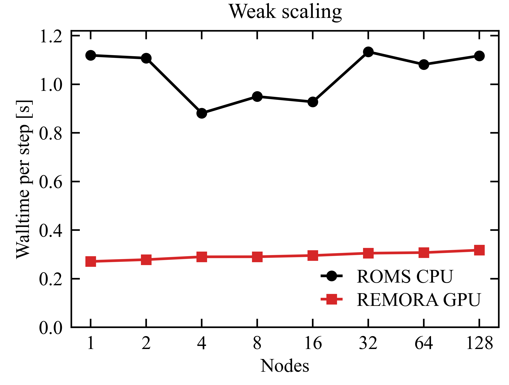
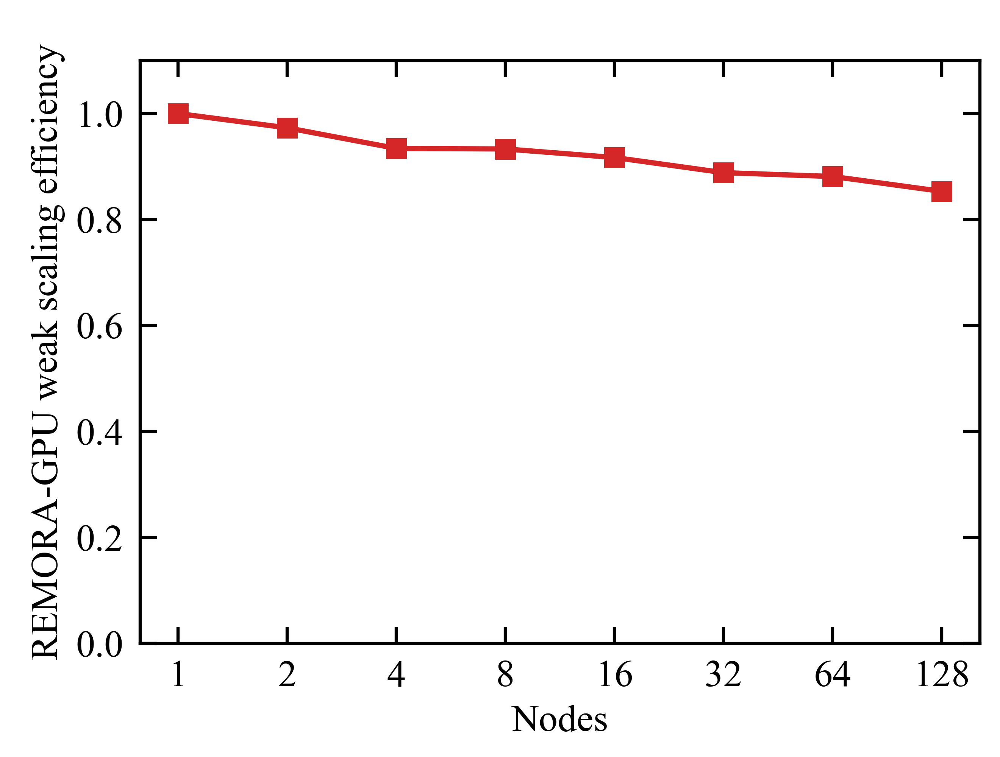
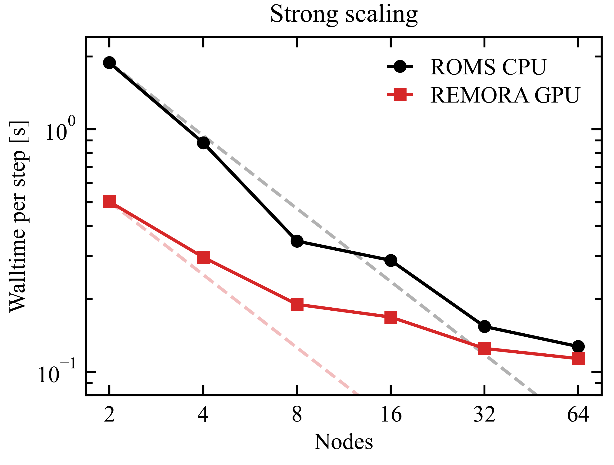

 .. role:: cpp(code)
    :language: c++

.. _Performance:

Performance
===========

GPU weak scaling
----------------

We performed weak and strong scaling studies comparing the performance of REMORA-GPU and ROMS-CPU on Perlmutter. In the weak scaling test, the problem size increases proportionally in x and y with the amount of resources allocated; all tests had 128 vertical levels. Overall, REMORA-GPU is generally 3-4x faster than ROMS for the same problem size on the same number of Perlmutter nodes. REMORA also shows excellent 85% weak scaling efficiency at 128 nodes.

.. _fig:weak:

    Comparison of time per step for a weak scaling test of the upwelling problem in REMORA-GPU and ROMS.
    REMORA-GPU is generally 3-4x faster than ROMS for the same problem size on the same number of Perlmutter nodes.

    Weak scaling efficiency of REMORA on GPUs for the upwelling problem. Scaling efficiency stays high, over 85 percent to 128 nodes.

GPU strong scaling
------------------

In the strong scaling tests, the problem size is held constant at 2048 by 1024 by 128 cells in the x, y, and vertical directions. The results for a strong scaling study on ROMS (black) and REMORA-GPU (red) are shown in the right panel of Figure X. Ideal strong scaling performance is shown in the dashed lines. In all simulations, REMORA-GPU was faster than ROMS, with largest speedups on smaller node counts where each GPU has more work. Both ROMS and REMORA-GPU show diminishing returns past about 8 nodes (32 GPUs), with minimal reduction in walltime per step between 32 and 64 nodes.

    Comparison of time per step for a strong scaling test for the upwelling problem of 2048 by 1024 by 128 cells in the x, y, and vertical directions, respectively.
