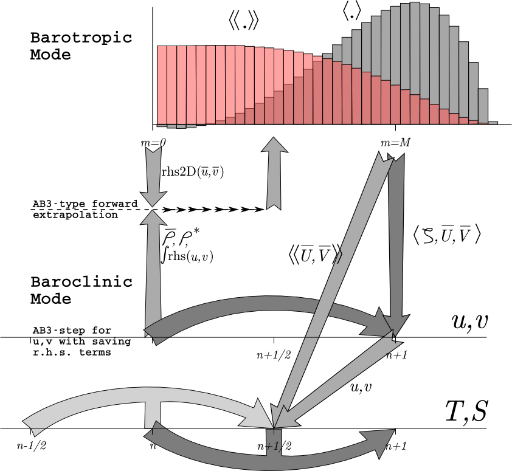

 .. role:: cpp(code)
    :language: c++

.. _Time_Stepping:

Time Stepping Overview
======================
While time-stepping the model, we have a stored history of the model fields at time :math:`n-1`, an estimate of the fields at the current time :math:`n`, and we need to come up with an estimate for time :math:`n+1`. For reasons of efficiency, we choose to use a split-explicit time-step, integrating the depth-integrated equations with a shorter time-step than the full 3-D equations. There is an integer ratio :math:`M` between the time-steps. The exact details of how the time-stepping is done vary from one version of ROMS to the next, with the east coast ROMS described here being older than other branches. Still, most versions have these steps:

Great care is taken to avoid the introduction of a mode-splitting instability due to the use of shorter time steps for the depth-integrated computations.
The mode coupling has evolved through the various ROMS versions, as shown in the figures below [from ``Shchepetkin and McWilliams (2008a)``]. The time-stepping schemes are also listed in the following table and described in detail in ``Shchepetkin and Williams (2005)`` and ``Shchepetkin and McWilliams (2009)``; the relevant ones are described in ``Time-stepping Schemes Review``. REMORA uses the Rutgers Scheme.

The following figure shows the time-stepping and mode coupling used in REMORA. The curved arrows update the 3-D fields; those with "pillars" are leapfrog in nature with the pillar representing the r.h.s. terms. Straight arrows indicate exchange between the barotropic and baroclinic modes. The shape functions for the fast time steps show just one option out of many possibilities. The grey function has weights to produce an estimate at time :math:`n+1`, while the light red function has weights to produce an estimate at time :math:`n+1/2`.

Rutgers ROMS:
~~~~~~~~~~~~~~~~~~~~~~~~~

Timestepping table from ``Shchepetkin and McWilliams (2008a)``:

+---------------------------------+-------------------------------+---------------------+--------------------------+-------------------+-------------------+
|                                 | SCRUM 3.0                     | Rutgers             | AGRIF                    | UCLA              | Non-hydrostatic   |
+=================================+===============================+=====================+==========================+===================+===================+
| barotropic                      | LF-TR                         | LF-AM3 with FB      | LF-AM3 with FB           | Gen. FB           | Gen. FB           |
| mode                            |                               | feedback            | feedback :math:`\dagger` | (AB3-AM4)         | (AB3-AM4)         |
+---------------------------------+-------------------------------+---------------------+--------------------------+-------------------+-------------------+
| 2-D :math:`\alpha_{\max}`,iter. | :math:`\sqrt{2}, (2)\ddagger` | :math:`1.85, (2)`   | :math:`1.85, (2)`        | :math:`1.78, (1)` | :math:`1.78, (1)` |
+---------------------------------+-------------------------------+---------------------+--------------------------+-------------------+-------------------+
| 3-D momenta                     | AB3                           | AB3                 | LF-AM3                   | LF-AM3            | AB3 (mod)         |
+---------------------------------+-------------------------------+---------------------+--------------------------+-------------------+-------------------+
| Tracers                         | AB3                           | LF-TR               | LF-AM3                   | LF-AM3            | AB3 (mod)         |
+---------------------------------+-------------------------------+---------------------+--------------------------+-------------------+-------------------+
| internal                        | AB3                           | Gen. FB             | LF-AM3,                  | LF-AM3            | Gen. FB           |
| waves                           |                               | (AB3-TR)            | FB feedback              | FB feedback       | (AB3-AM4)         |
+---------------------------------+-------------------------------+---------------------+--------------------------+-------------------+-------------------+
| :math:`\alpha_{\max}`,advect.   | :math:`0.72`                  | :math:`0.72`        | :math:`1.587`            | :math:`1.587`     | :math:`0.78`      |
+---------------------------------+-------------------------------+---------------------+--------------------------+-------------------+-------------------+
| :math:`\alpha_{\max}`,Cor.      | :math:`0.72`                  | :math:`0.72`        | :math:`1.587`            | :math:`1.587`     | :math:`0.78`      |
+---------------------------------+-------------------------------+---------------------+--------------------------+-------------------+-------------------+
| :math:`\alpha_{\max}`,int. w.   | :math:`0.72, (1)`             | :math:`1.14, (1,2)` | :math:`1.85, (2)`        | :math:`1.85, (2)` | :math:`1.78, (1)` |
+---------------------------------+-------------------------------+---------------------+--------------------------+-------------------+-------------------+

*Note:* :math:`\dagger` The generalized FB barotropic mode was ported into the newest AGRIF code at the end of 2007.
:math:`\ddagger` The number in parentheses (e.g., 2) indicates the number of r.h.s. computations per time step. If there are two parenthesized numbers, the first one is for momenta, the second for tracers.

Time Stepping: Internal Velocity Modes and Tracers
~~~~~~~~~~~~~~~~~~~~~~~~~~~~~~~~~~~~~~~~~~~~~~~~~~
The momentum equations are advanced before the tracer equation, by computing all the terms except the vertical viscosity and then using the implicit scheme described in ``#Vertical Friction and Diffusion`` to find the new values for :math:`u` and :math:`v`. The depth-averaged component is then removed and replaced by the :math:`\langle \overline{u} \rangle` and :math:`\langle \overline{v} \rangle` computed as in ``#Depth-Integrated Equations``. A third-order Adams-Bashforth (AB3) time step is used, requiring multiple right-hand-side time levels. These stored up r.h.s. values can be used to extrapolate to a value at time :math:`n+\frac{1}{2}`, obtained from the predictor step. The vertical diffusion is computed as in ``#Vertical Friction and Diffusion``. The predictor step cannot be both constancy=preserving and conservative; it was therefore decided to make it constancy-preserving. Also, since it is only being used to compute the advection for the corrector step, the expensive diffusion operations are not carried out on the predictor step.

The preceeding notes on tracer advection refer to all but the MPDATA option. The MPDATA algorithm has its own predictor-corrector with emphasis on not allowing values to exceed their original range, and therefore gives up the constancy-preservation. This will be most noticeable in shallow areas with large tides.
